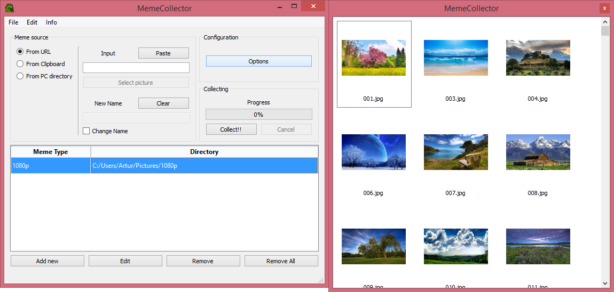
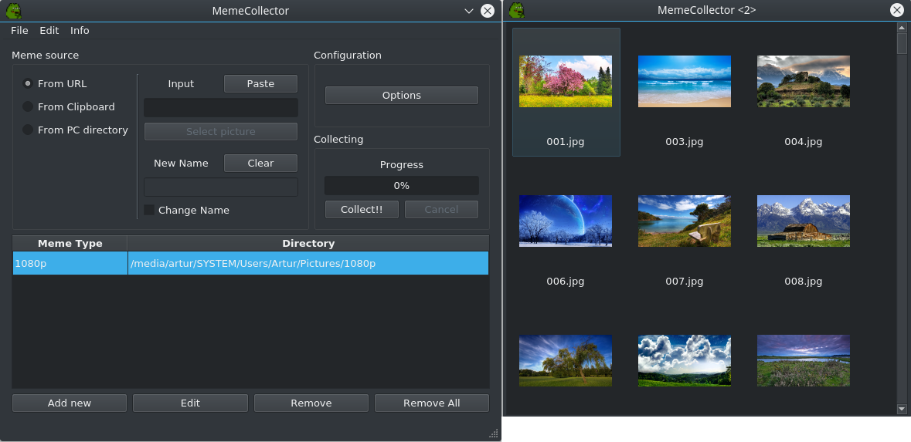

# MemeCollector
MemeCollector is a multi-platform application automatising collecting images from the internet. It let's you categorize them and preview them in simple image viewer.

## Features
- Collecting images from three sources - internet URL, clipboard and local files
- Quick-collect windows simplifying downloading images
- Grouping images into categories and manage them
- Image viewer with image thumbnails capable of simple image manipulations
- Caching thumbnails for faster loading

## Releases 
[All releases](https://github.com/artudi54/MemeCollector/releases "All releases")
### Pre-build with bundled Qt dependencies packages:
[Windows x64](https://github.com/artudi54/MemeCollector/releases/download/1.0_windows/MemeCollector.zip "Windows x64")

[Linux x64](https://github.com/artudi54/MemeCollector/releases/download/1.0_linux/MemeCollector.zip "Linux x64")

## Project Details
This project was created with Visual Studio 2017. Qt ".pro" and ".pri" files were automatically generated by Qt Visual Studio add-on. Hotkeys support is provided by [QHotkey](https://github.com/Skycoder42/QHotkey, "QHotkey") library. C++14 is required to compile this project.
